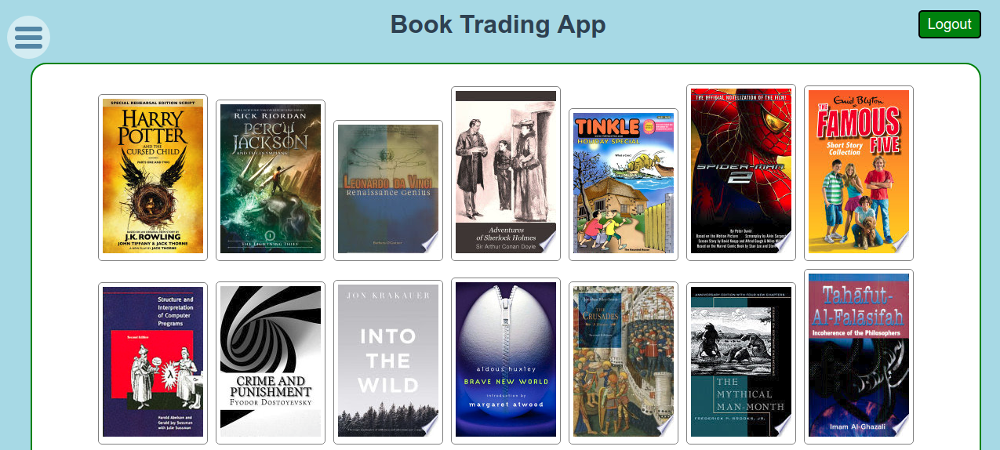
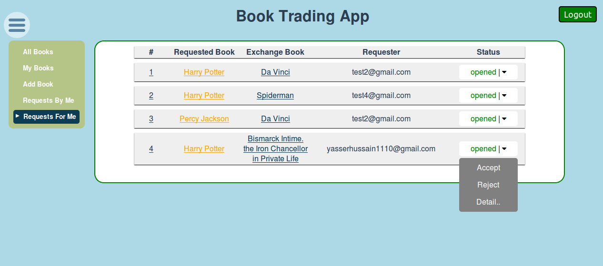

## BookTrading App

An app for trading books.

## Prerequisites
Make sure you have the following installed.
 * Node (version, >= 7)
 * Mongo (version, >= 3)

## Starting the App
Follow below steps to start the app locally for the first time.

 * clone this repo
 * cd into the `BookTradingApp` directory
 * Run - `npm i` to install depencies
 * Run - `cp sample.env .env`
 * Fill the **.env** file with appropriate values
 * Run - `mkdir data` to create a **db** directory
 * Run - `mongod --dbpath ./data > /dev/null &` to start mongo server
 * Run - `npm fill` to fill the database with seed values
 * Run - `npm start` to start the server

 [Note]:- You need to follow the above steps first time only. From next time onwards start the server by running `npm start`.

## Salient Features
This app helps send/receive/manage trade requests for books.

### Feature #1 - Book Gallery

User can view all the books available, i.e. books owned by **all** the users can be viewed.

### Feature #2 - Add/Delete a book

User can add a book to the app. Adding a book in the app means that the user is indicating they possess the book.

The app has a built in search system, which helps a user search for a book and add it.

The search API uses the [Google Books API](https://developers.google.com/books/) on the backend, which ensures the correct ISBN number is retreived which helps identify a book accurately.

User can read the summary of the book before deciding whether that book is the one they wish to add.

User can add mutiple books at the same time.

User can have multiple copies of the same book.

### Feature #3 - Opening Trade Requests

This is the core feature of this app, i.e, users can exchange books.

When a user opens a trade request for a book, the user may decide to give or not give any book in exchange.

#### No exchange requests

If a user decides `not` to give a book in exchange, the real life parallel is like asking for a book from someone.

#### With exchange requests
If a user asks for a book and wants to give their book in return then this is like actually exchanging a book in real life scenario.

**Both the above options are possible using this app.**

There are basically two ways to open `trade requests`.

#### Select other's book
User can select someone else's book while viewing the book list in the gallery.

This opens a window showing details of the book (*summary*, *added by*, etc). This window also contains a `trade` action button. When the `trade` button is clicked, a dropdown emerges asking to confirm the trade request. In addition to that there is **optional** section where user can add a book they would like to give in exchange.

[Note]:- The exhange book section is **optional** here.

If request is made without using it, then this is **Category #1** [no exchange request](#no-exchange-requests)

If a user selects their own book from the optional section, then this is **Category #2** [with exchange request](#with-exchange-requests)

#### Select one's own book
User can select their own book in `My Books` section.

This opens a window which again has the `trade` button.
When it is selected again a dropdown is shown asking to confirm the request.

But this time there is **mandatory** section showing books belonging to all other people and asking to select.

This should be obvious because making a `Trade Request` just by selecting one's own book makes no sense.

User must select someone else's book and submit request.

This will be the **Category #2** [with exchange request](#with-exchange-requests)

### Feature #4 - Managing Trade Requests

As should be obvious by now there are two kinds of `Trade Request`.

#### Trade Request Opened by a User
User can open `Trade Requests By Me` section to see a list of requests opened by them.

They can see the book they asked for and the book they wanted to give in exchange (if they **did** want to give a book in exhange, remember this is **optional**).

The only action a user can perform in this situation is `close` the `Trade Request`.

#### Trade Request Opened for a User
User can open `Trade Requests For Me` section to see a list of requests opened by **other** users asking for books they own.

They can see the book the other user asked for and the book the other user wanted to give in exchange (if at all, this is **optional**).

User can perform two options here:-
##### `Reject`
If user selects reject, the `requester` (the one who opened the request) is informed.

##### `Accept`
If this is selected, books are exchanged. Other additional actions also take place.
See [below](feature-5-intelligent-trade-request-management)

### Feature #5 - Intelligent Trade Requests Management

If a user accepts a `Trade Request` for a particular book. It makes sense that he is implicitly rejecting other `Trade Requests` for the same book.

Hence these are the steps which the system performs when a user accepts a `Trade Request`.

 * All pending requests by other users asking for the same book is automatically `rejected`. (If you have accepted the trade request of one person for a book, it automatically means you have rejected other requests for the same book.)

 * All pending requests by the user in which this particular book was supposed to be given away as exchange book are `closed`. (If you have accepted the trade request of one person for a book, it means you will no longer possess the book. And so you cannot tell anyone that you want to give this book in exchange.)

## TODO:-

* Expand README to add project's implementation details.
* Use browser's local storage and do away with express session.
* Cleanup UI, particularly trade modal dropdown.
* Add linting to webpack
* Go back to All Books page when user logs out.
